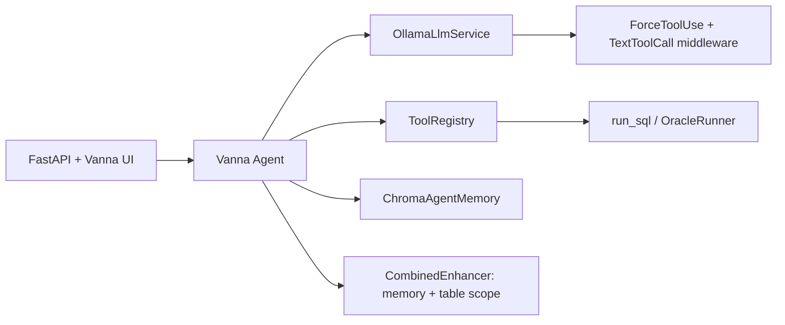

# AGENTS.md

Guidance for AI coding agents working in this repository.

## Project summary

**nl-2-sql-vanna-oracle-pc** is a Vietnamese natural-language → Oracle SQL chat app built on [Vanna 2](https://github.com/vanna-ai/vanna). Users ask flight-data questions in Vietnamese; the agent calls `run_sql` against an ATFM Oracle schema and returns results in the web UI.

| Layer | Technology |
|-------|------------|
| Agent framework | Vanna 2 (`vanna[fastapi,httpx,ollama]`) |
| LLM | Ollama (default: `qwen2.5-coder`) |
| Database | Oracle via `oracledb` / `OracleRunner` |
| Agent memory | ChromaDB (tool-use + text memories) |
| Web server | FastAPI + Uvicorn |
| Package manager | [uv](https://docs.astral.sh/uv/) |
| Python | ≥ 3.12 |

Domain: **ATFM flight tables** (`ATFM.T_DAY_FLIGHTS`, `ATFM.T_FINISHED_FLIGHTS`) with a fixed column allowlist. UI copy and workflow responses are Vietnamese (`content/vi.py`).

## Repository layout

```
nl-2-sql-vanna-oracle/
├── main.py, agent.py          # Entry points → create_server().run()
├── train.py                   # Seeds Chroma from training_data.py
├── run.bat                    # Dev server (uvicorn + reload)
├── run-ngrok.bat              # Expose :8000 via ngrok
├── .env.oracle.example        # Env template (copy to .env)
├── pyproject.toml
├── src/nl_2_sql_vanna_oracle_pc/
│   ├── app.py                 # Agent wiring (LLM, tools, memory, middleware)
│   ├── asgi.py                # FastAPI `app` for uvicorn
│   ├── settings.py            # Frozen Settings from env
│   ├── database.py            # Oracle RunSqlTool + JSON-safe rows
│   ├── tools.py               # ToolRegistry + access groups
│   ├── memory.py              # ChromaAgentMemory wrapper
│   ├── training.py            # Async seed for train.py
│   ├── training_data.py       # ToolMemory examples + SCHEMA_CONTEXT
│   ├── schema_context.py      # Canonical schema / column docs
│   ├── system_prompt.py       # AtfmSystemPromptBuilder
│   ├── llm.py                 # OllamaLlmService factory
│   ├── llm_context.py         # TableScope + tool-memory enhancers
│   ├── llm_middleware.py      # Ollama text→tool_call parsing, force run_sql
│   ├── tool_use.py            # Vietnamese data-question heuristics
│   ├── workflow.py            # /help, HITL commands, starter cards
│   ├── hitl.py                # Lifecycle hook + feedback UI injection
│   ├── sql_scope.py           # ALLOWED_TABLES validation for training/HITL
│   ├── auth.py                # Cookie-based user (admin@example.com)
│   ├── auth_middleware.py     # Optional app HTTP Basic Auth
│   ├── audit.py               # JSONL audit logger
│   ├── server.py              # FastAPI + voice UI template
│   ├── content/vi.py          # Vietnamese strings
│   └── ui/                    # index.html, voice-input.js
├── chroma_db/                 # Created at runtime (gitignored)
└── logs/                      # app.log, audit.jsonl, feedback.jsonl (gitignored)
```

## Setup (local)

3. Install deps: `uv sync`
4. Seed memory (after env is valid): `uv run python train.py`
5. Run app: `run.bat` or:
   ```bash
   uv run python -m uvicorn nl_2_sql_vanna_oracle_pc.asgi:app --host 0.0.0.0 --port 8000 --reload --reload-dir src --reload-include .env
   ```
6. Open `http://localhost:8000`. Set cookie `vanna_email=admin@example.com` for admin tools.

Re-run `train.py` after changing `training_data.py` or `schema_context.py` — it clears the Chroma collection then re-seeds (no duplicates). **Warning:** that also removes admin-approved examples saved from chat. Delete `./chroma_db` only when changing `CHROMA_COLLECTION_NAME` or resetting all collections.

## Architecture



**Request path:** User message → `AtfmWorkflowHandler` (commands like `/help`, `/save_to_memory`) → LLM with enhancers → middleware may parse JSON/SQL blocks or retry with forced `run_sql` → `FullResultRunSqlTool` → Oracle → (if HITL) feedback buttons → user approves before Chroma write.

### Human-in-the-loop training (`HITL_ENABLED=true`)

After a successful `run_sql`, all users see 👍 / 👎 buttons in `<vanna-chat>`. Nothing is written to Chroma automatically.

| Action | Who | Effect |
|--------|-----|--------|
| 👍 `/save_to_memory` | Everyone clicks | **Admin:** commits Q→SQL to Chroma. **Guest/user:** logs feedback only (`logs/feedback.jsonl`). |
| 👎 `/reject_memory` | Everyone | Clears pending save, logs negative feedback. Admins see hint to use `/correct_sql`. |
| `/correct_sql <SQL>` | Admin only | Saves corrected SQL to Chroma (allowlist-validated). |

Cookie `vanna_email=admin@example.com` for admin commit. Set `HITL_ENABLED=false` to restore LLM-driven `save_question_tool_args` behavior.

## Configuration

All runtime config comes from **`.env`** via `settings.py` (`load_dotenv()` at import). Do not commit `.env`.

| Variable | Purpose |
|----------|---------|
| `OLLAMA_*` | Model, host, optional Basic Auth |
| `ORACLE_*` | Credentials and DSN |
| `CHROMA_*` | Persist dir and collection name |
| `ALLOWED_TABLES` / `ALLOWED_COLUMNS` | SQL scope (comma-separated, uppercased internally) |
| `APP_BASIC_AUTH_*` | Protect entire FastAPI app |
| `LOG_*` / `AUDIT_*` | Application and audit logging |
| `HITL_ENABLED` / `HITL_FEEDBACK_LOG_FILE` | Human approval before memory writes; feedback JSONL |

Reference: `.env.oracle.example`.

## Coding conventions

- **Package name:** `nl_2_sql_vanna_oracle_pc` under `src/` (setuptools `where = ["src"]`).
- **Factories:** Prefer `create_*()` modules (`create_agent`, `create_db_tool`, `create_llm_service`) over inline construction in `app.py`.
- **Settings:** Add new env keys to `Settings` dataclass in `settings.py`; document in `.env.oracle.example`.
- **Scope changes:** Table/column rules live in `schema_context.py`, `TableScopeEnhancer` (`llm_context.py`), and env allowlists—keep them aligned.
- **Training:** Add `ToolMemory` rows to `training_data.py`; `training.py` skips examples that reference tables outside `ALLOWED_TABLES`.
- **Vietnamese UX:** User-facing strings go in `content/vi.py`, not inline in Python unless trivial.
- **UI:** Customize `ui/templates/index.html` and `ui/static/`; do not patch Vanna site-packages.
- **Logging:** Use `logging.getLogger(__name__)`; startup summary via `logging_config.log_startup_summary`.
- **Minimize diffs:** Match existing style; avoid unrelated refactors or new abstractions for one-off fixes.

## Security and safety

- Never commit secrets (`.env`, passwords, ngrok tokens).
- SQL is constrained by `ALLOWED_TABLES` / `ALLOWED_COLUMNS` in prompts and training filters—not a substitute for DB-level grants. Assume least-privilege Oracle users in production.
- `audit_sanitize_tool_parameters` redacts sensitive tool args in audit logs when enabled.
- `SaveQuestionToolArgsTool` is **admin-only** (`tools.py` access groups). With HITL on, the LLM is instructed not to call it; admins commit via `/save_to_memory` or `/correct_sql`.

## Common agent tasks

| Task | Where to edit |
|------|----------------|
| New example question → SQL | `training_data.py`, then `uv run python train.py` |
| Schema / column documentation | `schema_context.py` (+ env allowlists if needed) |
| Stricter SQL / Oracle dialect rules | `llm_context.py` (`TableScopeEnhancer`), `system_prompt.py` |
| Ollama tool-call quirks | `llm_middleware.py`, `tool_use.py` |
| New tool or permissions | `tools.py`, `app.py` |
| HITL / feedback / memory approval | `hitl.py`, `workflow.py`, `content/vi.py`, `settings.py` |
| UI / voice | `server.py`, `ui/` |
| Remote access | `run-ngrok.bat`, `APP_BASIC_AUTH_*` in `.env` |

## What not to do

- Do not commit `chroma_db/`, `logs/`, `.venv/`, or `.env`.
- Do not use non-Oracle SQL dialects (`TOP`, `LIMIT`, `GETDATE()`, etc.) in examples or prompts.
- Do not add columns or tables outside the ATFM allowlist without updating env, `schema_context.py`, enhancers, and training data together.
- Do not remove `ForceToolUseMiddleware` / `TextToolCallMiddleware` without validating Ollama native tool calls for your model.
- Do not create git commits or push unless the user explicitly asks.

## Dependencies note

`sqlglot` is listed in `pyproject.toml` but is not central to the current agent path; prefer Vanna/Oracle integrations already in use before adding new SQL parsers.

## Troubleshooting

| Symptom | Check |
|---------|--------|
| Empty or stale SQL patterns | Re-run `train.py`; verify Chroma path/collection |
| Model answers in prose, no query | Middleware logs; try force-tool retry; confirm Ollama model |
| Oracle connection errors | `ORACLE_*` / network; `logs/app.log` |
| Wrong table in SQL | `ALLOWED_TABLES`, `TableScopeEnhancer`, training examples |
| 401 on remote UI | `APP_BASIC_AUTH_*` or ngrok setup |

## Testing
There is no automated test suite in this repo today. After changes, manually run `train.py`, start the server, and exercise a Vietnamese flight question that should hit `run_sql`.

**HITL manual checks** (with `HITL_ENABLED=true`):

1. Cookie `vanna_email=guest@example.com` → ask a flight question → see 👍/👎 after results → click 👍 → confirm message says feedback recorded (no Chroma commit).
2. Cookie `vanna_email=admin@example.com` → same flow → 👍 → re-ask a similar question; retrieval should improve.
3. Admin → 👎 → `/correct_sql SELECT ...` with valid allowlisted SQL → verify via `/memories`.
4. Confirm `logs/feedback.jsonl` receives events with `committed: true` only for admin saves.
5. Set `HITL_ENABLED=false` and restart → prior auto-save via `save_question_tool_args` is allowed again in the system prompt.
