# Vanna 2.0: How Improvement Works

This document describes how **Vanna 2.0** improves NL→SQL over time, how this project uses those mechanisms, and practical steps to get better results. Vanna does **not** fine-tune the LLM; improvement comes from **vector memory (RAG)**, **system prompts**, and **tools**.

---

## Improvement model (overview)

```mermaid
flowchart TD
  Q[User question] --> SP[System prompt]
  Q --> Search[search_saved_correct_tool_uses]
  TM[Text memory in Chroma] --> Enhancer[DefaultLlmContextEnhancer]
  Enhancer --> SP
  Search --> LLM[LLM picks tool + args]
  SP --> LLM
  LLM --> Run[run_sql / visualize_data / ...]
  Run -->|success| Save[save_question_tool_args]
  Save --> Chroma[(AgentMemory / ChromaDB)]
  Chroma --> Search
  Seed[train.py seed] --> Chroma
```



---

## 1. Two types of memory (`AgentMemory`)

| Type | API | What is stored | When to use |
|------|-----|----------------|-------------|
| **Tool usage** | `save_tool_usage` / `search_similar_usage` | Question + `tool_name` + `args` (e.g. SQL) | “This question → this SQL/tool call” |
| **Text memory** | `save_text_memory` / `search_text_memories` | Schema notes, business rules, definitions | Domain knowledge, not one-off query results |

**Backends:**

- **ChromaDB** — local persistent storage (this project)
- **DemoAgentMemory** — in-memory, lost on restart
- **CloudAgentMemory** — managed production option

References:

- [Memory Backends](https://vanna.ai/docs/placeholder/memory-backends)
- [Built-in Tools](https://vanna.ai/docs/placeholder/built-in-tools)
- Source: [vanna-ai/vanna](https://github.com/vanna-ai/vanna)

---

## 2. Three ways to add knowledge

### A. Manual seeding (`train.py`)

Calls `save_tool_usage` and `save_text_memory` directly — no chat required.

- Source: `src/nl_2_sql_vanna_sql_pc/training_data.py`
- Runner: `train.py` → `seed_agent_memory()`

**Important:** `train.py` only **appends** to Chroma. For a clean retrain, delete the Chroma persist directory (or use a new `CHROMA_COLLECTION_NAME`) before running `train.py` again.

### B. At runtime — LLM calls memory tools

`DefaultSystemPromptBuilder` adds a workflow when these tools are registered:

1. **Before** `run_sql` / `visualize_data`: call `search_saved_correct_tool_uses`
2. **After** a successful, correct run: call `save_question_tool_args`
3. **Domain knowledge**: call `save_text_memory` when appropriate

This project registers them in `src/nl_2_sql_vanna_sql_pc/tools.py`:

| Tool | Access groups |
|------|----------------|
| `search_saved_correct_tool_uses` | admin, user |
| `save_question_tool_args` | **admin only** |
| `save_text_memory` | admin, user |

### C. Automatic injection — `DefaultLlmContextEnhancer`

On each user message, searches **text memories** (up to 5) and appends them to the system prompt under “Relevant Context from Memory”.

- Does **not** auto-inject tool/SQL patterns — those require the search tool (B).

This project combines enhancers in `app.py`:

- `DefaultLlmContextEnhancer(agent_memory)` — text memory from seed
- `TableScopeEnhancer(settings.allowed_tables)` — T-SQL rules, allowed tables, Vietnamese UX

---

## 3. Tool memory is not in the prompt by default

SQL examples in Chroma are retrieved only when the model calls `search_saved_correct_tool_uses`.

If the model skips search (common with some Ollama setups), trained SQL patterns are underused even after `train.py`.

Docs may say “save on every successful tool use”; in practice Vanna 2.0 relies on the LLM calling `save_question_tool_args` — there is no automatic save in the core agent loop after `execute()`.

---

## 4. Poisoned memory risk

- SQL can **execute without error** but return **wrong business results** (wrong column, wrong join, wrong aggregate).
- If the model calls `save_question_tool_args`, that pattern can be reused for similar questions.

Community discussion:

- [Issue #1103 — Wrong SQL auto-saved to Tool Memory](https://github.com/vanna-ai/vanna/issues/1103)
- [PR #1102 — Human-in-the-loop (`require_human_approval_for_memory`)](https://github.com/vanna-ai/vanna/pull/1102)

When `require_human_approval_for_memory=True`, the UI shows a “Save to memory” control; nothing is persisted until the user approves. This project does not enable that flag yet.

---

## 5. Memory management (Vanna API)

Documented operations (implement via scripts or admin tools):

```python
# Clear all memories
await agent.agent_memory.clear_memories(context)

# Clear for a specific tool
await agent.agent_memory.clear_memories(context, tool_name="run_sql")

# Clear before a date
await agent.agent_memory.clear_memories(context, before_date="2024-01-01")

# Stats
stats = await agent.agent_memory.get_tool_usage_stats(context)
tools = await agent.agent_memory.list_tools_with_memories(context)
```

Search tuning:

```python
results = await memory.search_similar_usage(
    question="Show me sales",
    context=context,
    limit=10,                    # more results
    similarity_threshold=0.7,    # lower = more matches, higher = stricter
)
```

Memories are **user-scoped** by default (each user’s patterns are isolated).

---

## 6. Other extension points (not memory)

| Mechanism | Role in this project |
|-----------|----------------------|
| `LlmContextEnhancer` | `TableScopeEnhancer` — Vietnamese replies, T-SQL only, allowed tables, `SELECT TOP n` |
| `LlmMiddleware` | `TextToolCallMiddleware` — models that emit tool calls as text/markdown |
| `LifecycleHook` | Not used yet — could validate SQL before execute or gate saves |
| Schema / DDL | Vanna does **not** pull DDL from the DB; provide via text memory or enhancer ([Discussion #1027](https://github.com/vanna-ai/vanna/discussions/1027)) |

---

## 7. This project vs full Vanna improvement

| Vanna recommendation | This project |
|------------------------|--------------|
| Persistent Chroma | Yes — `CHROMA_PERSIST_DIRECTORY`, `CHROMA_COLLECTION_NAME` |
| Seed SQL examples | Yes — `training_data.py` + `train.py` |
| Search before SQL | Tool registered; depends on model following system prompt |
| Save after success | `save_question_tool_args` — **admin only** |
| Text schema / rules | Yes — `SCHEMA_CONTEXT`, `BUSINESS_CONTEXT` + `DefaultLlmContextEnhancer` |
| Fresh retrain | Manual — delete Chroma folder before `train.py` |
| Human-approved memory | Not configured |
| SQL validation guard | Not implemented (`sqlglot` is a dependency but unused) |

**Registered tools** (`tools.py`):

- `RunSqlTool` (custom `FullResultRunSqlTool`)
- `VisualizeDataTool`
- Memory tools (search / save / text)
- No custom `ChartTool` — charts use Vanna’s `VisualizeDataTool`

---

## 8. Recommended improvement roadmap

### Quick wins

1. **Fix training copy** — Align `BUSINESS_CONTEXT` with `llm_context.py` (e.g. “Top N” → `SELECT TOP N ... ORDER BY`, never `TOP` after `ORDER BY`).
2. **Add training examples** for frequent failure patterns (e.g. top 5 countries by spend, revenue via `InvoiceLine`).
3. **Fresh retrain** — Delete Chroma persist dir → `uv run python train.py` → restart server.

### Medium term

4. **Vietnamese eval set** — ~20–30 fixed questions; run after prompt/train/model changes.
5. **Prompt for charts** — After successful `run_sql`, call `visualize_data` when the user asks for a chart.
6. **Stronger model / tool calling** — Coder-oriented Ollama models; keep `TextToolCallMiddleware`.

### Harder / production

7. **`sqlglot` guard** — Parse/fix T-SQL before `run_sql` (e.g. misplaced `TOP`).
8. **Retry on SQL error** — Feed ODBC error + T-SQL rules back to the model once.
9. **`require_human_approval_for_memory`** — Prevent bad SQL from entering memory.
10. **`train --fresh` script** — Wrap clear + seed so retrain is one command.

---

## 9. Retrain procedure (this repo)

1. Stop the server (`run.bat`).
2. Check `.env` for `CHROMA_PERSIST_DIRECTORY` and `CHROMA_COLLECTION_NAME`.
3. Delete the persist directory contents (or the whole folder), e.g. `chroma_db\`.
4. Run: `uv run python train.py`
5. Start the server again.

Do **not** delete `training_data.py` for a normal retrain — edit it, then re-seed Chroma.

---

## 10. T-SQL pitfall: `TOP` placement

**Wrong (SQL Server error 156):**

```sql
ORDER BY TotalSpent DESC
TOP 5;
```

**Correct:**

```sql
SELECT TOP 5
    c.Country,
    SUM(il.UnitPrice * il.Quantity) AS TotalSpent
FROM Customer c
...
ORDER BY TotalSpent DESC;
```

Rule in `llm_context.py`: use `SELECT TOP n`, not `LIMIT`, and never place `TOP` after `ORDER BY`.

---

## 11. Sample Vietnamese test questions (Chinook)

Use data-request phrasing so the agent calls `run_sql` (not “write SQL for me”).

**Smoke test (matches `training_data.py`):**

1. Liệt kê top 10 khách hàng chi tiêu nhiều nhất.
2. Liệt kê tất cả hóa đơn ngày 1 tháng 1 năm 2009.
3. Mỗi thể loại nhạc có bao nhiêu bài hát?
4. Liệt kê album và tên nghệ sĩ của AC/DC.
5. 5 bài hát dài nhất là gì? Hiển thị tên và độ dài tính bằng phút.
6. Tổng doanh thu theo từng thể loại nhạc.
7. Nhân viên nào phụ trách khách hàng ở Brazil?
8. Playlist Music có bao nhiêu bài hát?
9. Khách hàng ở USA chưa từng có hóa đơn nào.
10. Khách hàng nào mua nhiều hóa đơn nhất?

**Additional patterns:**

- Top 5 quốc gia chi tiêu nhiều nhất.
- Doanh thu theo từng quốc gia khách hàng.
- Vẽ biểu đồ doanh thu theo thể loại nhạc.

**Term mapping (Vietnamese → SQL tables):**

| Vietnamese | Table |
|------------|--------|
| khách hàng | Customer |
| hóa đơn | Invoice |
| bài hát | Track |
| album | Album |
| nghệ sĩ | Artist |
| thể loại | Genre |
| playlist | Playlist |
| nhân viên | Employee |

Literal values in the DB stay English: `'Brazil'`, `'USA'`, `'AC/DC'`, `'Music'`.

---

## Summary

**Vanna improves by storing successful question→tool patterns and domain text in a vector DB, retrieving them via tools and enhancers, and instructing the LLM to search before acting and save after success.** This project has the foundation (Chroma, seed, enhancers, memory tools). The main gaps are: model compliance with search/save, non-destructive retrain, SQL validation, and optional human approval before persisting memory.
